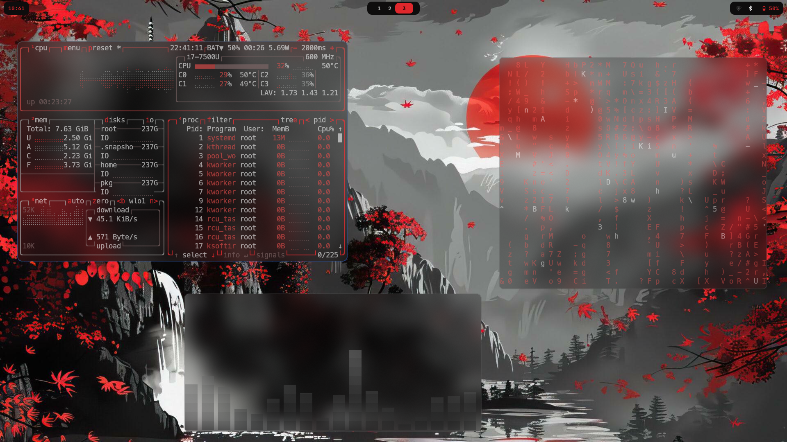
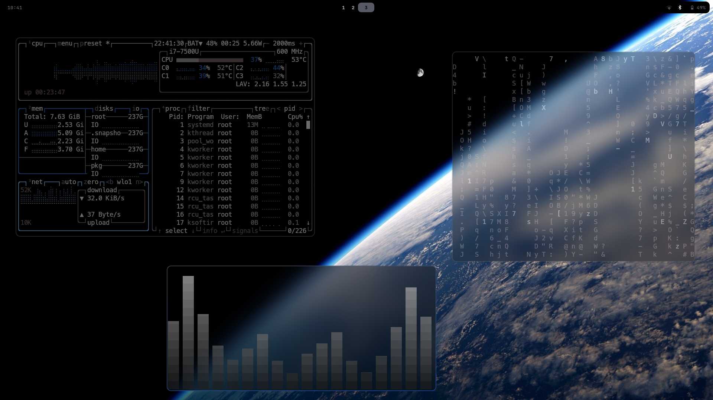
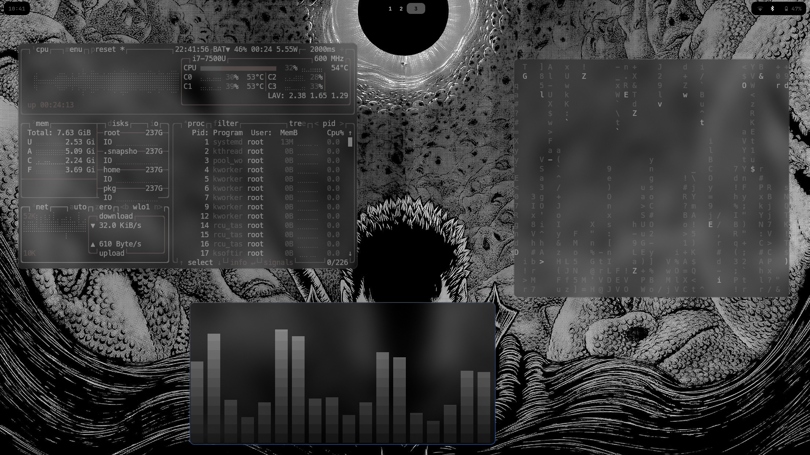

# 🚀 Dotfiles 🚀

Welcome to this dotfiles repository! This collection of configuration files will help you set up a sleek and efficient development environment in no time.

## 🌟 Preview

<div align="center">
  
  
  
</div>

Get ready for a visually stunning and highly functional setup!

## 🛠️ Installation

Follow these steps to bring your system to life!

### Step 1: Install Dependencies

First, make sure you have all the necessary tools:

```bash
yay -S hyprland-git tofi waybar-cava cava cmus btop fastfetch kitty neovim networkmanager thunar swww pywal blueman-git hyprlock-git hyprshot-git pavucontrol nwg-look mpv
```

### Step 2: Clone the Repository

Get these dotfiles on your system:

```bash
git clone https://github.com/dhaneshdutta/dotfiles.git
```

### Step 3: Copy Configuration Files

⚠️ **IMPORTANT: BACKUP YOUR EXISTING CONFIGS FIRST!** ⚠️

```bash
cp -r dotfiles/.config dotfiles/.zshrc dotfiles/.bashrc $HOME
```

## 🎨 Features

These configs are designed to be:

- 🧱 Immutable across systems
- 🚀 Easy to install
- 💻 Productivity-boosting

## 🌈 What's Included?

- Hyprland config
- Tofi setup
- Waybar with Cava integration
- CMUS for music
- Btop for system monitoring
- Fastfetch for system info
- Kitty terminal configuration
- Neovim setup

## 🎉 Enjoy!

Feel free to reach out if you have any questions or suggestions!

---
