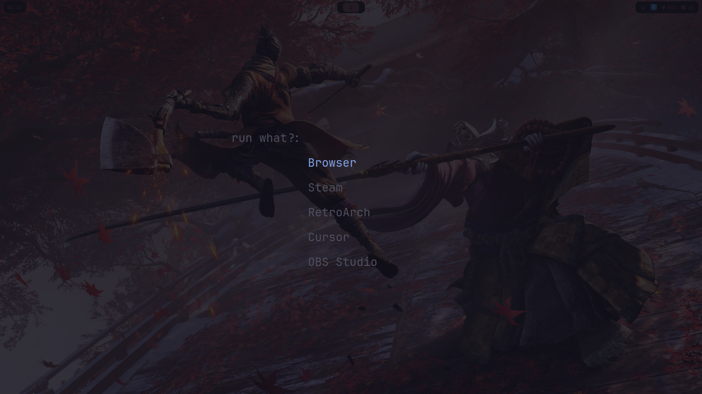
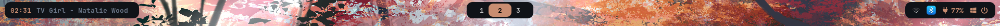

# 🚀 Dotfiles 🚀

Streamline your development environment with this curated collection of configuration files. Get a sleek, efficient setup in minutes.

## 🌟 Preview

<div align="center">
https://github.com/user-attachments/assets/8d6bebb5-966b-4b58-ba06-515af05207b1
  <p><strong>Custom Animations</strong></p>

https://github.com/user-attachments/assets/7f602c51-f470-450a-8058-4b596e667967
  <p><strong>Pywal Integration</strong></p>

  
  <p><strong>App Launcher</strong></p>

  
  <p><strong>Waybar integrated with pywal</strong></p>
</div>

## 🛠️ Installation

Before installation, backup your existing configurations:

### Backing Up Your Existing Configs

```bash
mkdir -p ~/config_backup
cp -r ~/.config ~/config_backup/
cp ~/.zshrc ~/config_backup/
cp ~/.bashrc ~/config_backup/
```

Choose between automatic (beta) or manual installation:

### Automatic Installation (Beta)

1. Remove any previous clone:
   ```bash
   rm -rf ~/dotfiles
   ```

2. Clone and install:
   ```bash
   git clone https://github.com/dhaneshdutta/dotfiles.git
   cd dotfiles
   ./install.sh
   ```

⚠️ **NOTE:** Beta version. Report any issues encountered.

### Manual Installation

1. Install dependencies:
   ```bash
   yay -S hyprland-git tofi waybar-cava cava cmus btop fastfetch kitty neovim networkmanager thunar swww pywal blueman-git hyprlock-git hyprshot-git pavucontrol nwg-look mpv
   ```

2. Clone the repository:
   ```bash
   git clone https://github.com/dhaneshdutta/dotfiles.git
   ```

3. Copy configuration files:
   ```bash
   cp -r dotfiles/.config ~/
   cp dotfiles/.zshrc ~/
   cp dotfiles/.bashrc ~/
   ```

## 🎨 Features

- 🧱 Immutable across systems
- 🚀 Easy to install
- 💻 Productivity-boosting

## 🌈 What's Included?

- Hyprland config
- Tofi setup
- Waybar with Cava integration
- CMUS for music
- Btop for system monitoring
- Fastfetch for system info
- Kitty terminal configuration
- Neovim setup
- Pywal for dynamic color schemes
- Custom wallpapers and themes

## 🎉 Enjoy!

Questions or suggestions? Feel free to reach out!

---
